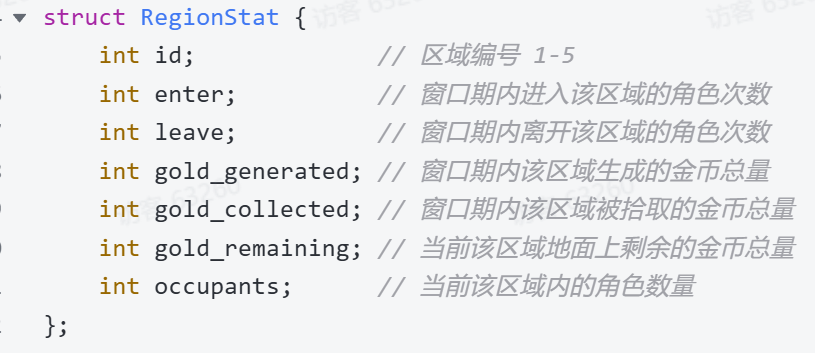
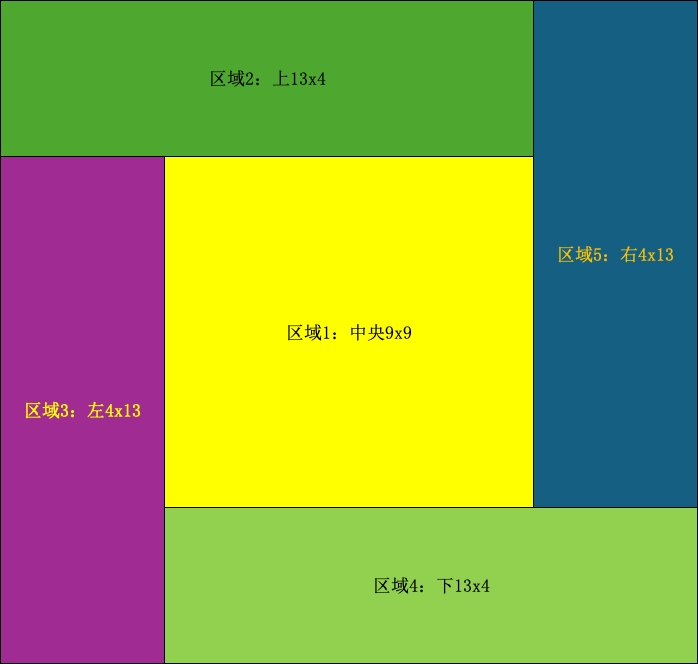
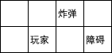

# GoldRush2.0-编程掘金争夺赛  | FAQ

[文档源链接](https://l4x826wg3c.feishu.cn/docx/CBmCdsPOhomGgExiS7LcuSkhnrb)

## 📌置顶公示

## 📅**活动日历**


## 📕赛事资料

**goldrush 1\.0赛题规则**

赛事指南：[GoldRush\-极速金币编程争夺赛 \| 赛制介绍](https://l4x826wg3c.feishu.cn/docx/IdG1dpK27o1s8xxXZd1c67ennSb)

官方答疑：[GoldRush\-极速金币编程争夺赛 \| FAQ](https://l4x826wg3c.feishu.cn/docx/WwzFd4FhzoELk9xVrDvc4fnnnWc)

**goldrush 2\.0赛题规则**

赛事指南：[GoldRush2\.0\-编程掘金争夺赛 \| 赛制介绍](https://l4x826wg3c.feishu.cn/docx/XkiEd5k5eoaN2Rx5Y1VcgaoPnKd?from=from)

官方答疑：[GoldRush2\.0\-编程掘金争夺赛  \| FAQ](https://l4x826wg3c.feishu.cn/docx/CBmCdsPOhomGgExiS7LcuSkhnrb)

- 赛事账号：赛事服务器、参赛账号信息请通过报名邮箱获取（报名审核通过2个工作日内发放）

- 赛事环境：为了方便大家开发，统一收集环境需求，欢迎通过问卷反馈：

- PS：名为game的conda环境里应该有一些大家可能经常会用到的库

[问卷](🔗https://l4x826wg3c\.feishu\.cn/share/base/form/shrcnGy5v0lASkGUXPvIR1Vo1Db)

**九坤GoldRush 2\.0 赛 线上答疑会**

2026年8月12日晚19:30\-20:00

[https://meeting\.tencent\.com/dm/aV39P3ga6aux](https://meeting.tencent.com/dm/aV39P3ga6aux)
\#腾讯会议：251\-990\-356

## 一、报名阶段（7\.7～8\.14）

### Q:本次比赛每个奖项有几个名额呀？

A: 总榜前三名玩家可分别获得下方冠军、亚军、季军相应奖金和礼品。为了满足多元化的需求，奖品支持自定义，可等价兑换成你最需要的礼物。

- **GoldRush\-极速金币争夺赛****上榜荣誉**

**冠军团队：50,000**元现金及荣誉证书

每位选手可获得**Apple Watch Series 11**

**亚军团队：30,000**元现金及荣誉证书

每位选手可获得  **马歇尔头戴式降噪蓝牙耳机**

**季军团队：10,000** 元现金及荣誉证书

每位选手可获得 **影石Insta360 GO Ultra**

**极致优化奖****：****5,000**元现金及荣誉证书

每位选手可获得**西部数据硬盘2TB**

- **入围决赛团队均获阳光普照奖：九坤限量版礼包****（Champion定制版双肩包）**

- **更多赛事介绍，请点击：**[赛事介绍](https://mp\.weixin\.qq\.com/s/cP3MhQRIQNYhQag2bn4Enw)

### Q:报名只需要队长提交信息就可以吗？怎么算报名成功?

A:需要队伍中**每位参赛同学单独**填写报名表单，队名一致，报名通过后由坤坤小助手邀请加入赛事微信群。**入群即为报名成功！**

- 专属玩家群：2026玩家群｜九坤GoldRush2\.0争夺群

- 辛苦大家修改群备注为【队名\-姓名】，方便工作人员快速识别大家。此外，若队伍人数\>1人，每位队员都需提交报名表单噢 o\(o･\`з･´o\)ﾉ

- 报名链接：[报名链接](https://app\.mokahr\.com/campus\_apply/ubiquantrecruit/41168?hash=%23%2Fjob%2Fffa5ccb4\-8907\-4f5a\-9965\-dd06a5a77d87%3Ffrom%3Dqrcode%26isRecommendation%3Dfalse)

### Q:报名后队伍里还可以再添加新同学吗?

A:**我们是****8\.14****周****五**** 23:59截止报名**，如果比较早能确定，可以等队员齐了再报名；如果晚一点确定，建议先报名后更新。只要确保报名时的**队伍名称和队长姓名**一致即可。注意：如有任何变动，同步联系**坤坤小助手**进行更新。

坤坤助手微信：Ubihr2012

运营备用微信：18401746373

## 二、公测阶段（7\.20\-8\.21

### Q:请问每轮传入的 GameInput\.grid，只包含两个角色在本轮决策时最终位置的当前视野，还是会包含上一轮移动过程中两个角色沿途看到的所有新视野信息？ 如果只返回最终视野，接口是否会通过其他字段提供本轮移动过程中的视野增量或已探索地图？

A:每轮传入的GameInput\.grid只包含两个角色在本轮决策时最终位置的当前视野。不会提供移动过程中的视野增量或已探索地图。

### Q:区域是如何划分的呢，如果每次划分不同，5个区域的边界怎么得到？



A：公测和初赛会固定用这个区域划分方法～



### Q：文档中的 A/B/C/D/N/S/X/Y/T 仍是占位符，此外还缺少 VP 费用与持续时间、NPC policy、随机生成分布、炸弹刷新时序、己方角色能否重叠、视野购买何时生效、快照的 occupants/enter/leave 是否包含 NPC 等定义

A:  数值相关的，公测之后会更新（已经更新）。两个玩家的一共4个角色之间两两不能重叠。视野购买下回合生效，生效时长1回合，可以连续购买。快照信息包括NPC，快照信息中的进出次数的定义：任意一个玩家的角色/NPC,在本回合开始前不在这个区域，本回合结束后在这个区域，那么这个区域会累计一次进入次数。出的次数同理。

### Q: 分布是公开的吗，那请问会有下发的模拟器吗

A: 分布不会公开。不会下发模拟器。但是公测期间会给大家提供若干对局的对局日志（已提供，路径：/share/data\.tar\.gz\)。

### Q: 编译服务器和正式运行服务器配置

编译服务器届时会给大家提供。正式运行服务器配置参考如下，无GPU。

conda路径：/share/opt/anaconda3，conda环境名称为game。如果你需要的一些库没有提供，可以在这里提交申请：[申请](https://l4x826wg3c\.feishu\.cn/share/base/form/shrcnGy5v0lASkGUXPvIR1Vo1Db)

```Bash
Architecture:                x86_64
  CPU op-mode(s):            32-bit, 64-bit
  Address sizes:             52 bits physical, 57 bits virtual
  Byte Order:                Little Endian
CPU(s):                      32
  On-line CPU(s) list:       0-31
Vendor ID:                   AuthenticAMD
  BIOS Vendor ID:            Alibaba Cloud
  Model name:                AMD EPYC 9T25 128-Core Processor
    BIOS Model name:         pc-i440fx-2.1  CPU @ 0.0GHz
    BIOS CPU family:         1
    CPU family:              26
    Model:                   2
    Thread(s) per core:      1
    Core(s) per socket:      32
    Socket(s):               1
    Stepping:                0
    BogoMIPS:                5400.00
    Flags:                   fpu vme de pse tsc msr pae mce cx8 apic sep mtrr pge mca cmov pat pse36 clflush mmx fxsr sse sse2 ht syscall nx mmxext fxsr_opt pdpe1gb rdtscp lm constant_tsc rep_good amd_lbr_v2 no
                             pl xtopology nonstop_tsc cpuid extd_apicid aperfmperf tsc_known_freq pni pclmulqdq monitor ssse3 fma cx16 pcid sse4_1 sse4_2 x2apic movbe popcnt aes xsave avx f16c rdrand hypervisor
                              lahf_lm cmp_legacy extapic cr8_legacy abm sse4a misalignsse 3dnowprefetch osvw ibs topoext perfctr_core perfctr_llc mwaitx ssbd perfmon_v2 ibrs ibpb stibp ibrs_enhanced vmmcall fsg
                             sbase tsc_adjust bmi1 avx2 smep bmi2 erms invpcid avx512f avx512dq rdseed adx smap avx512ifma clflushopt clwb avx512cd sha_ni avx512bw avx512vl xsaveopt xsavec xgetbv1 xsaves avx_vn
                             ni avx512_bf16 clzero irperf xsaveerptr rdpru wbnoinvd arat avx512vbmi umip pku ospke avx512_vbmi2 gfni vaes vpclmulqdq avx512_vnni avx512_bitalg avx512_vpopcntdq rdpid movdiri movd
                             ir64b fsrm avx512_vp2intersect amd_lbr_pmc_freeze
Virtualization features:
  Hypervisor vendor:         KVM
  Virtualization type:       full
Caches (sum of all):
  L1d:                       1.5 MiB (32 instances)
  L1i:                       1 MiB (32 instances)
  L2:                        32 MiB (32 instances)
  L3:                        128 MiB (4 instances)
NUMA:
  NUMA node(s):              1
  NUMA node0 CPU(s):         0-31
```

### Q: NPC的移动策略是公开规则/固定算法吗

A: 不公开。

### Q: 每个回合完整的顺序是怎样的？

A: 生成新的金币/炸弹 \-\> 调用玩家策略 \-\> 策略耗时短的玩家行动 \-\> NPC行动 \-\> 策略耗时长的玩家行动。每回合两名玩家拿到的是行动前的同一份地图状态。

### Q: 服务器IP地址：8\.153\.76\.120 这个好像无法访问？/share/data\.tar\.gz这个是服务器上的路径吗？

A：同学你访问的是开发机，这台机器应该通过ssh来访问而不是用浏览器访问。通过浏览器访问的比赛网站是[网站](http://47\.103\.127\.219)。然后也可以排查一下是不是自己开了梯子之类的。

### Q: 当前 game\_api\.h 是否就是正式 C\+\+ ABI？ Python 到底返回 GameOutput 对象还是长度 9 的 list

A：game\_api\.h是正式C\+\+ ABI，Python参照player\.py，返回长度位9的list。

### Q: C\+\+ 提交源码包还是编译后的 \.so？ 编译机与运行机指令集是否一致

A：C\+\+提交so文件运行。和编译机相比，运行机除CPU未开超线程外，没有其他区别。

### Q: 正式比赛各阶段是否沿用当前参数？ 尤其 NPC 总数、外围生成间隔、金币生成数量

A：无法透漏

### Q: 视野费用如何进入终局比分？ gold\_opp 是毛金币还是已扣费用净金币，是否公开对手累计费用

A：每一局的胜负根据毛金币减掉视野花费后的剩余金币计算，gold\_opp是毛金币，玩家的策略在游戏过程中无法得知对方的视野花费，但是游戏结束后回放可以查看。

### Q: 一次视野购买是否同时扩大两个己方角色？ 地图边缘如何裁剪

A：自己提交一个对局查看回放即可

Q: 策略对象/共享库是否跨 500 轮保持进程和内存？ 若否，长期状态如何保存；

A：你的对象和共享库，会直接被dlopen加载进内存，不会每一轮执行完后就释放掉，而是会打完全部比赛或者你的程序异常退出后再释放。每一次你的代码被调用的时候，你都可以自行管理资源

### Q: 公测日志所示的余币语义是否沿用正式赛？ 同一角色离开再进入能否重复拾取，生成到角色脚下时是否自动拾取

A：是，只要从一个格子移动到另一个格子，就可以吃到新移动到格子上的金币，可以重复拾取，直接生成在脚下的无法拾取。

### Q: 公测日志所示的整套炸弹重采样是否沿用正式赛？ NPC 是否会触发炸弹

A：无法透漏

### Q: 踩踏是否每次进入都触发？ NPC 在玩家进入之后聚集是否追溯处罚

A：只有玩家行动后走到一个NPC个数 \>= 3的格子才会触发

### Q: 同一步进入同时含金币、炸弹和 3\+ NPC 的格子时如何结算？ 拾取、炸弹、踩踏的先后会改变扣款基数

A：同一个位置不会同时有炸弹和金币，也不会同时有炸弹和大于等于3NPC，同时有金币和踩踏时，先吃金币再发生踩踏扣除金币。

### Q: order 的精确语义是什么？ 一个角色执行完全部动作后另一个再执行，还是两者交替

A：一个角色执行完全部动作后另一个再执行

### Q: 四个玩家角色的碰撞细节是什么？ 可否进入本回合已腾出的格，双方对向交换如何处理

A：可以，一个角色走完后，只会占用走完后占的格子，其他格子其他角色都可以走。碰撞发生后，此角色的本步不会执行，然后后续步都会执行。例如一个角色打算走左上左，但是第一步左被其他角色挡住了，因此第一步无法行动，但是后续的上左可能会继续尝试行动

### Q: 随机生成允许落到角色、NPC、墙、旧炸弹或已有金币上吗？ 被实体覆盖的余币如何在输入中表达

A：金币在grid上应该有完整的表达，实体有另外的数组。

### Q: NPC 的规则边界是什么？ 是否受墙和炸弹影响、是否累计持币、7 个 NPC 的正式内部顺序如何确定

A：\.NPC持有的金币不参与玩家之间的胜负结算，其它信息无法透漏。

### Q: 快照生成与当前轮行动的边界是什么？ 日志中窗口标签与生成事件可能存在一轮边界差异

A：快照反映的就是上几轮的情况

### Q: 地图与出生位如何采样？ 障碍是固定、模板随机还是每局随机，玩家与两个对角线如何分配

A： P1主对角线，P2副对角线，障碍情况可以自行发起对局分析。

### Q: 格式非法、运行异常和超时是否整局直接判负？ 是否有单轮容错？

A：直接判负，无单轮容错

### Q: P90 延迟统计是否包含加载、日志 I/O、首次初始化？ 同耗时如何定先手，超出 300ms 的部分如何计入当前 60 秒时间池?

A:P90仅统计决策moveDecision。如果第一次moveDecision要初始化以及在moveDecision里进行日志IO的话，会被计入。只有每个回合超出300ms的部分会计入时池，不超过300ms的话不会计入。在纳秒的级别，同耗时的概率很低。如果确实同耗时的话，P1先手。

### Q: 同一个玩家的两个角色能否互相穿过、交换位置？碰撞是逐步按 order 实时判断，还是整条路径统一判定？

A：同一个玩家的角色不能互相穿过，交换位置。不同角色同一个回合路径有交集不一定会碰撞，只有进入了一个角色停留的格子才会碰撞。每一步发生碰撞时（不论是和其他角色碰撞还是和障碍物碰撞），该角色的这一步无法行动，但是如果本回合这个角色有其他的步，则会尝试走完后面的步。例如这种情况，玩家想走右右上，但是因为第二个右被障碍挡住了，所以第二步无法行动，第三步正常行动，就走到了炸弹上。



### Q: 初赛循环赛会使用几张地图、每对选手打几局？是否交换出生边、使用相同随机种子进行镜像对局？

A：前面的问题暂时无法透漏，会考虑交换出生边、使用相同随机种子进行镜像对局。

### Q: 炸弹刷新能否出现在玩家、NPC、金币或已有炸弹所在格？炸弹生成在角色脚下时，原地停留是否触发？

A：不会

### Q: 我们有 init 初始化的预热时间么?init 的回调么?  还是直接实现一下\_\_init\_\_ 即可

A：加载选手策略的时间上限10s；实现一下\_\_init\_\_就可以

### Q: 请问决赛是一定要线下吗 如果队伍里有人不能线下是否可以远程

A：决赛支持远程

### Q:c\+\+怎么办呢，写全局变量初始化里面吗

A：可以的

### Q:我如何判断上一个 round 是我快，还是对方快？视野内没敌人，是不是推断不了

A：引擎没有直接传入这个信息。你可以根据每回合开始前传入的数据来推断。对局中如何推断这个看你自己的实现了。回放的时候是可以显示双方的延迟的

### Q:C\+\+ 代码是怎么上传? 就传一个 \.so 文件么?

A：对，是上传一个so文件，文件大小限制是16MB；名为game的conda环境里应该有一些大家可能经常会用到的库

统一收集环境需求，欢迎通过问卷反馈，你需要什么库我们可以给你装好

[环境](🔗https://l4x826wg3c\.feishu\.cn/share/base/form/shrcnGy5v0lASkGUXPvIR1Vo1Db)

### Q:有没有提交次数限制？

A:为保障评测队列稳定、让每位选手的对局都能被及时运行，每支队伍每天最多可发起 500 场对局，北京时间每日 0 点重置。仅统计主动发起的对局;被其他队伍挑战的场次不占用次数。

### Q:请问GameInput中visible\_enemies中, 如果是视野内恰有两个敌方, 他们的顺序是否固定为角色0, 角色1?

A:不保证

### Q:请问障碍物生成一直是固定的吗，正赛也是一样的生成位置吗

A:一张地图障碍物的位置是固定的，不同地图之间障碍物的位置可能不同。正赛不保证使用当前的两张地图。

### Q:请问这个公测榜的“外战胜率”是什么意思？重新上传代码后，这个胜率会重置吗？

A：最近24小时，你主动去找别人对战以及别人来和你对战的胜率。重新上传代码后不会重置，得有人和你新上传的代码对战才能更新。以及这个结果是最近24个小时内，新代码，旧代码（如果有的话），以及你主动去找别人对战混合的结果。

### Q:请问 8\.153\.76\.120 服务器是什么用途？是不是说比赛所用的评测机就是这个服务器？

A：这台机器环境和评测机接近。可以供大家上去开发调试编译自己的策略。

### Q:请问排行榜上的 P90 us 是如何计算的？

A：你vs别人、别人vs你 的对局中，你每一局的p90延迟的中位数。会实时更新。但和胜率仅统计最近24小时不同，这个统计的是从公测以来所有相关的对局

## 三、初赛阶段（8\.17～8\.21）

## 四、决赛阶段（8\.22～9\.6）

## 诚信守则

1. 所有队伍请独立自主参赛，严禁共享比赛相关的账号密码、策略代码。

2. 赛事相关数据、代码demo、规则文档仅用于本期赛事，未经授权，不得传播及转载。充分遵守赛事规范，赛出风采。

3. 严禁通过任何未经授权的技术手段（包括但不限于利用系统漏洞、绕过访问控制）获取赛事组织方未主动公开的信息；一经发现，取消赛事成绩，并保留追究法律责任的权利。

4. 本期赛事解释权归九坤投资所有，如有问题请提前联系赛事工作人员。如发现泄露赛题行为包括不限于赛事规则、代码、数据的传播，将取消赛事成绩，并追究一定法律责任。
